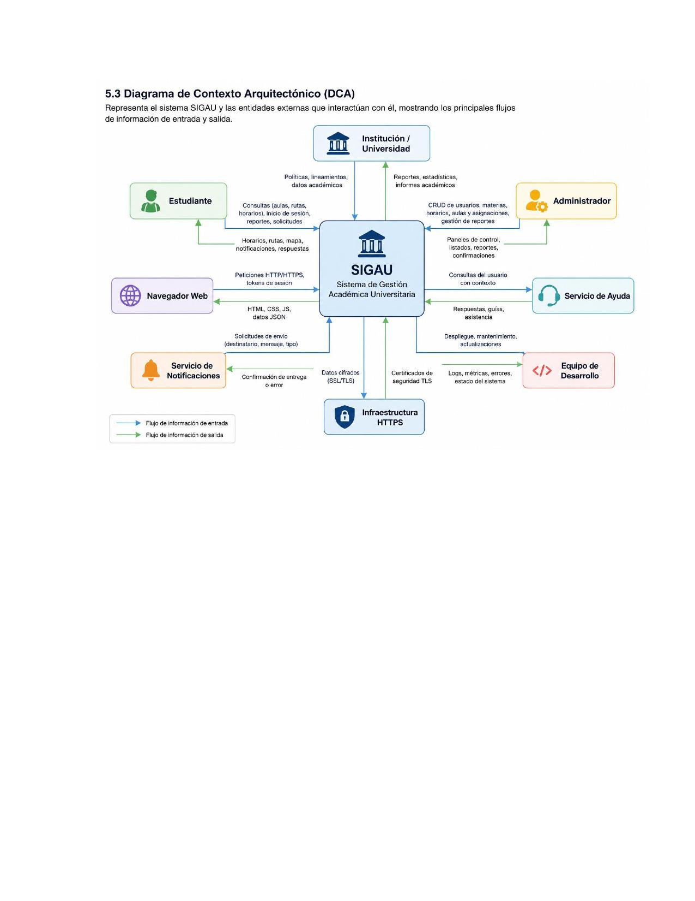

# 5.3 Diagrama de Contexto Arquitectónico (DCA)

Representa el sistema SIGAU y las entidades externas que interactúan con él, mostrando los principales flujos de información de entrada y salida.

## Entidades y flujos principales

- **Estudiante** → Consultas (aulas, rutas, horarios, inicio de sesión, reportes, solicitudes) → **SIGAU** → Horarios, rutas, mapa, notificaciones, respuestas
- **Administrador** → CRUD de usuarios, materias, horarios, aulas y asignaciones, gestión de reportes → **SIGAU** → Paneles de control, listados, reportes, confirmaciones
- **Institución / Universidad** → Políticas, lineamientos, datos académicos → **SIGAU** → Reportes, estadísticas, informes académicos
- **Navegador Web** → Peticiones HTTP/HTTPS, tokens de sesión → **SIGAU** → HTML, CSS, JS, datos JSON
- **Servicio de Notificaciones** → Confirmación de entrega o error → **SIGAU** → Solicitudes de envío (destinatario, mensaje, tipo)
- **Servicio de Ayuda** → Consultas del usuario con contexto → **SIGAU** → Respuestas, guías, asistencia
- **Infraestructura HTTPS** → Datos cifrados (SSL/TLS) → **SIGAU** → Certificados de seguridad TLS
- **Equipo de Desarrollo** → Despliegue, mantenimiento, actualizaciones → **SIGAU** → Logs, métricas, errores, estado del sistema
