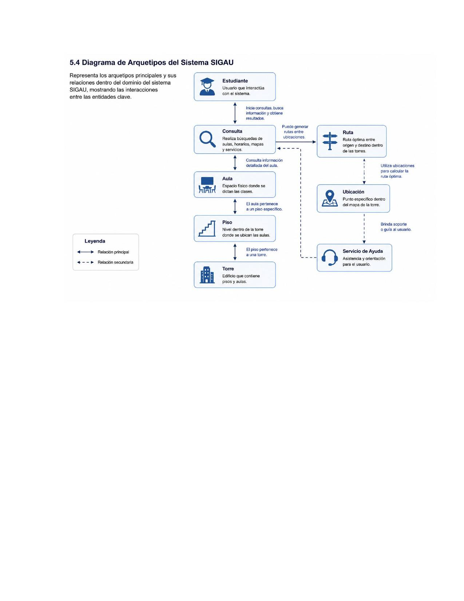

# 5.4 Diagrama de Arquetipos del Sistema SIGAU

Representa los arquetipos principales y sus relaciones dentro del dominio del sistema SIGAU, mostrando las interacciones entre las entidades clave.

## Arquetipos principales

- **Estudiante** — Usuario que interactúa con el sistema. Inicia consultas, busca información y obtiene resultados.
- **Consulta** — Realiza búsquedas de aulas, horarios, mapas y servicios. Consulta información detallada del aula.
- **Aula** — Espacio físico donde se dictan las clases. El aula pertenece a un piso específico.
- **Piso** — Nivel dentro de la torre donde se ubican las aulas. El piso pertenece a una torre.
- **Torre** — Edificio que contiene pisos y aulas.
- **Ruta** — Ruta óptima entre origen y destino dentro de las torres. Puede generar rutas entre ubicaciones.
- **Ubicación** — Punto específico dentro del mapa de la torre. Utiliza ubicaciones para calcular la ruta óptima.
- **Servicio de Ayuda** — Asistencia y orientación para el usuario. Brinda soporte o guía al usuario.

## Leyenda
- ↔ Relación principal
- ← - → Relación secundaria
