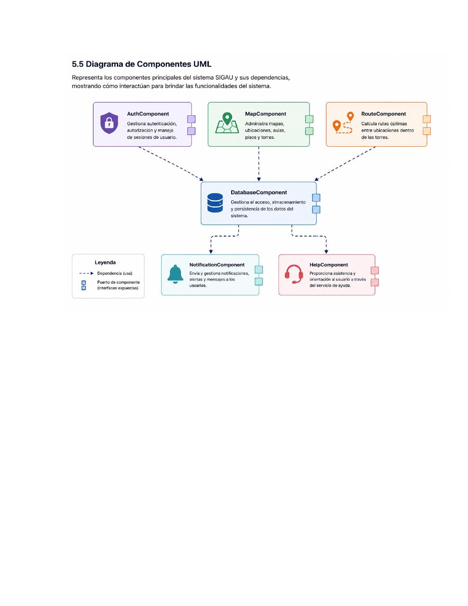

# 5.5 Diagrama de Componentes UML

Representa los componentes principales del sistema SIGAU y sus dependencias, mostrando cómo interactúan para brindar las funcionalidades del sistema.

## Componentes

- **AuthComponent** — Gestiona autenticación, autorización y manejo de sesiones de usuario.
- **MapComponent** — Administra mapas, ubicaciones, aulas, pisos y torres.
- **RouteComponent** — Calcula rutas óptimas entre ubicaciones dentro de las torres.
- **DatabaseComponent** — Gestiona el acceso, almacenamiento y persistencia de los datos del sistema.
- **NotificationComponent** — Envía y gestiona notificaciones, alertas y mensajes a los usuarios.
- **HelpComponent** — Proporciona asistencia y orientación al usuario a través del servicio de ayuda.

## Leyenda
- `- - →` Dependencia (usa)
- `[ ]` Puerto de componente (interfaces expuestas)
