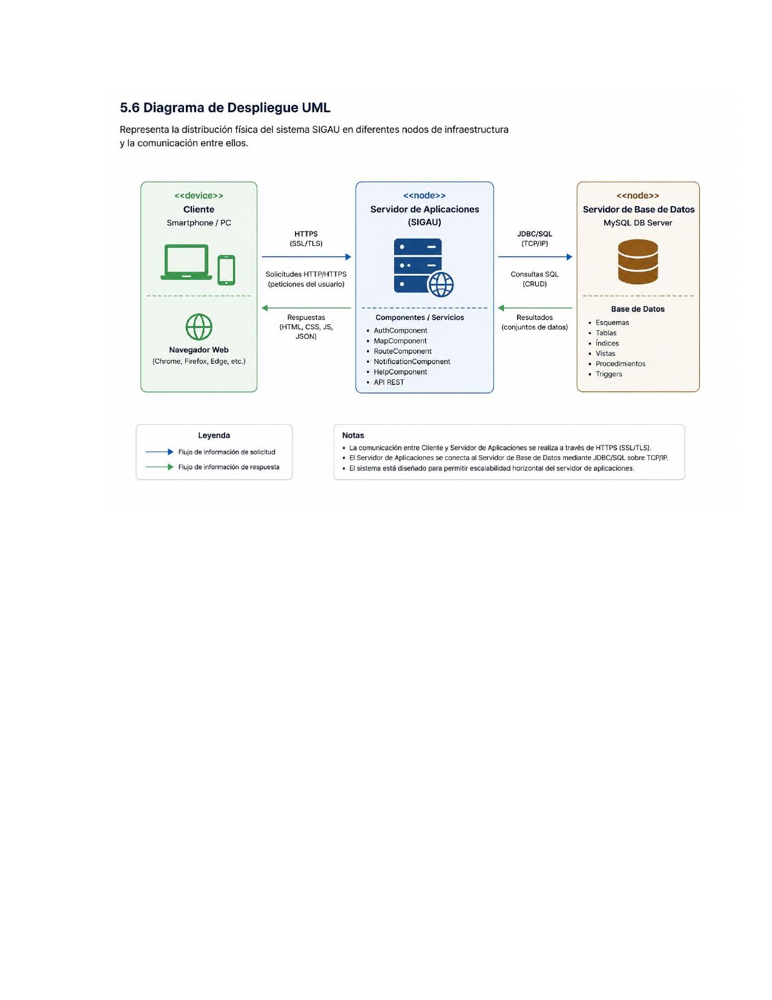

# 5.6 Diagrama de Despliegue UML

Representa la distribución física del sistema SIGAU en diferentes nodos de infraestructura y la comunicación entre ellos.

## Nodos

### <<device>> Cliente
- Smartphone / PC
- Navegador Web (Chrome, Firefox, Edge, etc.)

### <<node>> Servidor de Aplicaciones (SIGAU)
Componentes / Servicios:
- AuthComponent
- MapComponent
- RouteComponent
- NotificationComponent
- HelpComponent
- API REST

### <<node>> Servidor de Base de Datos
- MySQL DB Server
- Base de Datos: Esquemas, Tablas, Índices, Vistas, Procedimientos, Triggers

## Comunicación
- **Cliente → Servidor de Aplicaciones**: HTTPS (SSL/TLS) — Solicitudes HTTP/HTTPS
- **Servidor de Aplicaciones → Cliente**: Respuestas (HTML, CSS, JS, JSON)
- **Servidor de Aplicaciones → Base de Datos**: JDBC/SQL (TCP/IP) — Consultas SQL (CRUD)
- **Base de Datos → Servidor de Aplicaciones**: Resultados (conjuntos de datos)

## Notas
- La comunicación entre Cliente y Servidor de Aplicaciones se realiza a través de HTTPS (SSL/TLS).
- El Servidor de Aplicaciones se conecta al Servidor de Base de Datos mediante JDBC/SQL sobre TCP/IP.
- El sistema está diseñado para permitir escalabilidad horizontal del servidor de aplicaciones.
