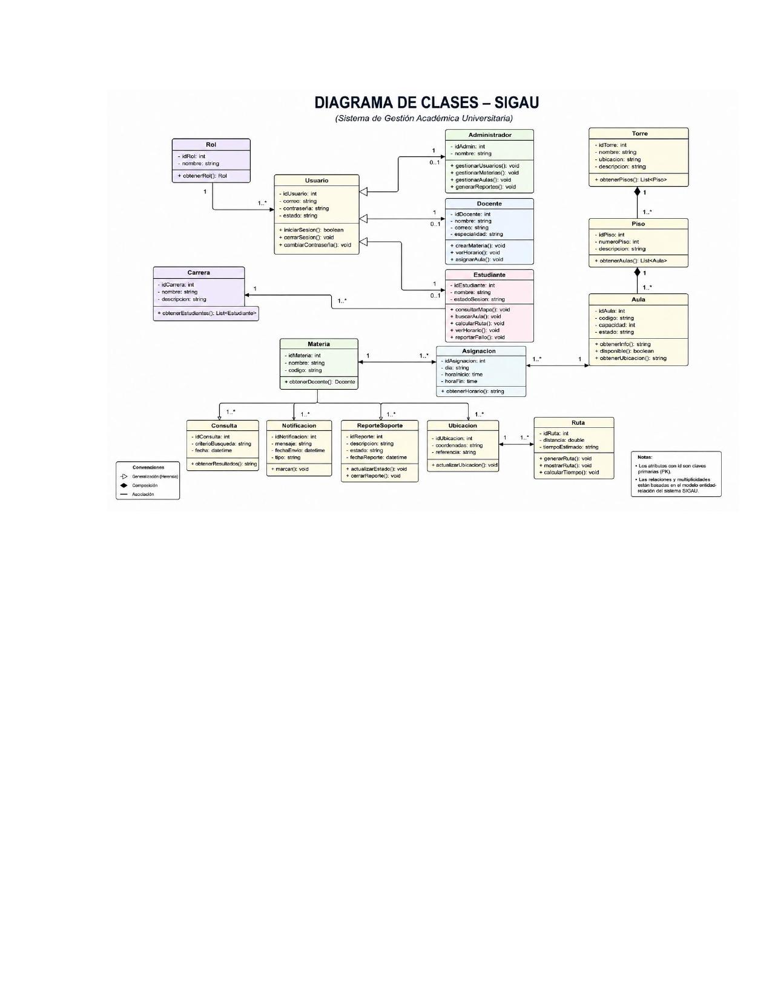

# Diagrama de Clases – SIGAU
*(Sistema de Gestión Académica Universitaria)*

## Clases principales

### Rol
- `idRol: int`, `nombre: string`
- `+ obtenerRol(): Rol`

### Usuario
- `idUsuario: int`, `correo: string`, `contraseña: string`, `estado: string`
- `+ iniciarSesion(): boolean`, `+ cerrarSesion(): void`, `+ cambiarContraseña(): void`

### Administrador
- `idAdmin: int`, `nombre: string`
- `+ gestionarUsuarios(): void`, `+ gestionarMaterias(): void`, `+ gestionarAulas(): void`, `+ generarReportes(): void`

### Docente
- `idDocente: int`, `nombre: string`, `correo: string`, `especialidad: string`
- `+ crearMateria(): void`, `+ verHorario(): void`, `+ asignarAula(): void`

### Estudiante
- `idEstudiante: int`, `nombre: string`, `estadoSesion: string`
- `+ consultarMapa(): void`, `+ buscarAula(): void`, `+ calcularRuta(): void`, `+ verHorario(): void`

### Carrera
- `idCarrera: int`, `nombre: string`, `descripcion: string`
- `+ obtenerEstudiantes(): List<Estudiante>`

### Materia
- `idMateria: int`, `nombre: string`, `codigo: string`
- `+ obtenerDocente(): Docente`

### Asignacion
- `idAsignacion: int`, `dia: string`, `horaInicio: time`, `horaFin: time`
- `+ obtenerHorario(): string`

### Torre
- `idTorre: int`, `nombre: string`, `ubicacion: string`, `descripcion: string`
- `+ obtenerPisos(): List<Piso>`

### Piso
- `idPiso: int`, `numeroPiso: int`, `descripcion: string`
- `+ obtenerAulas(): List<Aula>`

### Aula
- `idAula: int`, `codigo: string`, `capacidad: int`, `estado: string`
- `+ obtenerInfo(): string`, `+ disponible(): boolean`, `+ obtenerUbicacion(): string`

### Ubicacion
- `idUbicacion: int`, `coordenadas: string`, `referencia: string`
- `+ actualizarUbicacion(): void`

### Ruta
- `idRuta: int`, `distancia: double`, `tiempoEstimado: string`
- `+ generarRuta(): void`, `+ mostrarRuta(): void`, `+ calcularTiempo(): void`

### Consulta
- `idConsulta: int`, `criterioBusqueda: string`, `fecha: datetime`
- `+ obtenerResultados(): string`

### Notificacion
- `idNotificacion: int`, `nombre: string`, `mensaje: string`, `tipo: string`
- `+ marcar(): void`

### ReporteSoporte
- `idReporte: int`, `descripcion: string`, `estado: string`, `fechaReporte: datetime`
- `+ actualizarEstado(): void`, `+ cerrarReporte(): void`
