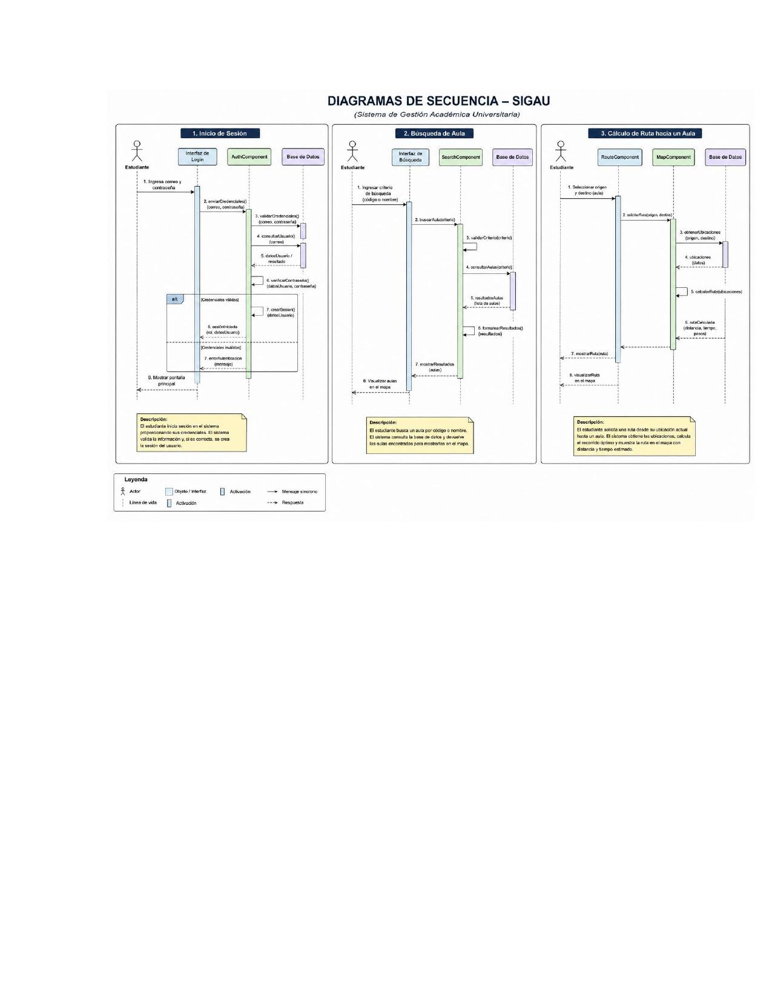

# Diagramas de Secuencia – SIGAU
*(Sistema de Gestión Académica Universitaria)*

## 1. Inicio de Sesión

**Actores:** Estudiante, Interfaz de Login, AuthComponent, Base de Datos

1. Estudiante ingresa correo y contraseña.
2. Interfaz envía `enviarCredenciales(correo, contraseña)` a AuthComponent.
3. AuthComponent ejecuta `validarCredenciales(correo, contraseña)`.
4. AuthComponent consulta `consultarUsuario(correo)` en Base de Datos.
5. Base de Datos retorna `datosUsuario / resultado`.
6. AuthComponent verifica `verificarContraseña(datosUsuario, contraseña)`.
7. Si válido: `crearSesion()` → `sesionIniciada(rol, datosUsuario)`.
8. Si inválido: `enviarMensajeError(mensaje)`.
9. Interfaz muestra portafolio principal.

**Descripción:** El estudiante inicia sesión proporcionando sus credenciales. El sistema valida la información y, si es correcta, se crea la sesión del usuario.

---

## 2. Búsqueda de Aula

**Actores:** Estudiante, Interfaz de Búsqueda, SearchComponent, Base de Datos

1. Estudiante ingresa criterio de búsqueda (código o nombre).
2. Interfaz ejecuta `buscarAula(criterio)` en SearchComponent.
3. SearchComponent ejecuta `validarCriterio(criterio)`.
4. SearchComponent consulta `consultarAulas(criterio)` en Base de Datos.
5. Base de Datos retorna `resultadosAula (lista de aulas)`.
6. SearchComponent formatea `formatearResultados(resultados)`.
7. Interfaz muestra resultados (aulas).
8. Estudiante visualiza aulas en el mapa.

**Descripción:** El estudiante busca un aula por código o nombre. El sistema consulta la base de datos y devuelve las aulas encontradas para mostrarlas en el mapa.

---

## 3. Cálculo de Ruta hacia un Aula

**Actores:** Estudiante, RouteComponent, MapComponent, Base de Datos

1. Estudiante selecciona origen y destino (aula).
2. RouteComponent ejecuta `solicitarRuta(origen, destino)`.
3. MapComponent ejecuta `obtenerUbicaciones(origen, destino)`.
4. Base de Datos retorna `ubicaciones (datos)`.
5. RouteComponent ejecuta `calcularRuta(ubicaciones)`.
6. RouteComponent ejecuta `rutaCalculada(distancia, tiempo, pasos)`.
7. Interfaz muestra ruta en el mapa.
8. Estudiante visualiza ruta en el mapa.

**Descripción:** El estudiante solicita una ruta desde su ubicación actual hasta un aula. El sistema obtiene las ubicaciones, calcula el recorrido óptimo y muestra la ruta en el mapa con distancia y tiempo estimado.

---

## Leyenda
- Actor, Objeto/Interfaz, Activación, Mensaje síncrono
- Línea de vida, Activación, Respuesta
