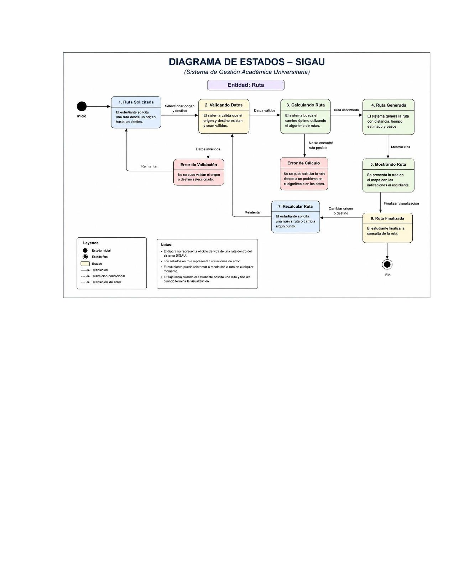

# Diagrama de Estados – SIGAU
*(Sistema de Gestión Académica Universitaria)*

**Entidad: Ruta**

## Estados

| Estado | Descripción |
|--------|-------------|
| **1. Ruta Solicitada** | El estudiante solicita una ruta desde un origen hasta un destino. |
| **2. Validando Datos** | El sistema valida que el origen y destino existan y sean válidos. |
| **3. Calculando Ruta** | El sistema busca el camino óptimo utilizando el algoritmo de rutas. |
| **4. Ruta Generada** | El sistema genera la ruta con distancia, tiempo estimado y pasos. |
| **5. Mostrando Ruta** | Se presenta la ruta en el mapa con las indicaciones al estudiante. |
| **6. Ruta Finalizada** | El estudiante finaliza la consulta de la ruta. |
| **7. Recalcular Ruta** | El estudiante solicita una nueva ruta o cambia algún punto. |
| **Error de Validación** | No se pudo validar el origen o destino seleccionado. |
| **Error de Cálculo** | No se pudo calcular la ruta debido a un problema en el algoritmo o en los datos. |

## Transiciones
- Inicio → Ruta Solicitada
- Ruta Solicitada → Validando Datos *(seleccionar origen y destino)*
- Validando Datos → Calculando Ruta *(datos válidos)*
- Validando Datos → Error de Validación *(datos inválidos)*
- Error de Validación → Ruta Solicitada *(reintentar)*
- Calculando Ruta → Ruta Generada *(ruta encontrada)*
- Calculando Ruta → Error de Cálculo *(no se encontró ruta posible)*
- Error de Cálculo → Validando Datos *(reintentar)*
- Ruta Generada → Mostrando Ruta *(mostrar ruta)*
- Mostrando Ruta → Ruta Finalizada *(finalizar visualización)*
- Ruta Finalizada → Recalcular Ruta *(cambiar origen o destino)*
- Recalcular Ruta → Validando Datos *(reintentar)*
- Ruta Finalizada → Fin

## Notas
- El diagrama representa el ciclo de vida de una ruta dentro del sistema SIGAU.
- Los estados en rojo representan situaciones de error.
- El estudiante puede reintentar o recalcular la ruta en cualquier momento.
- El flujo inicia cuando el estudiante solicita una ruta y finaliza cuando termina la visualización.
